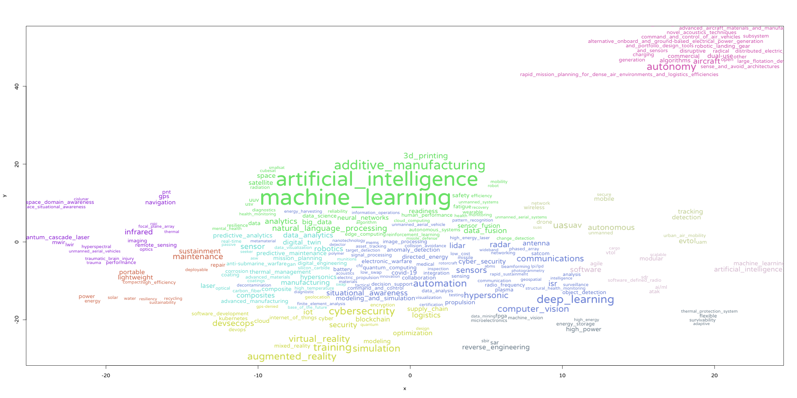
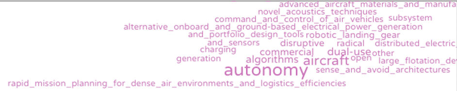
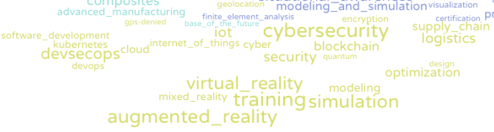
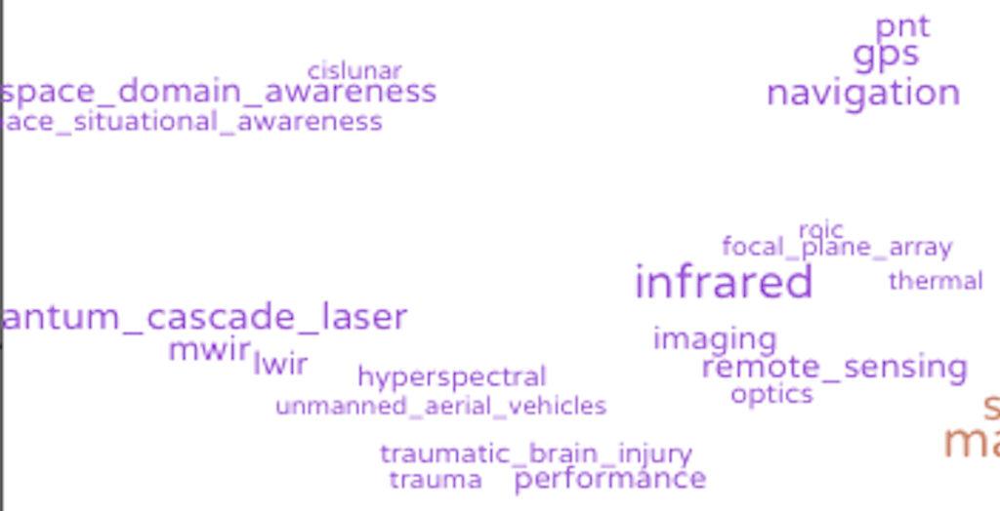
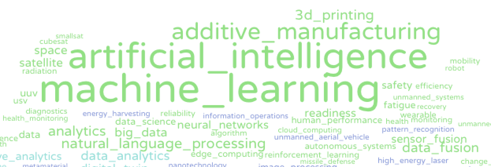
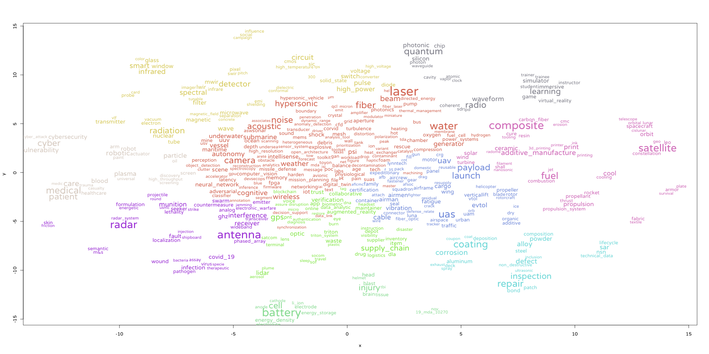
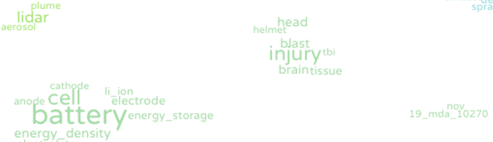
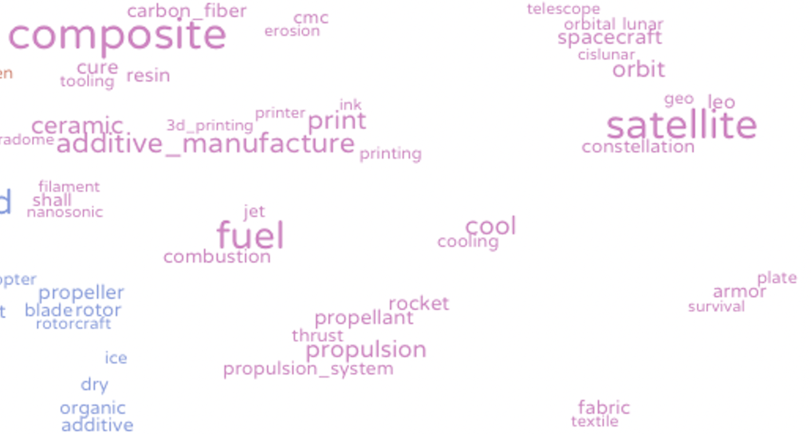
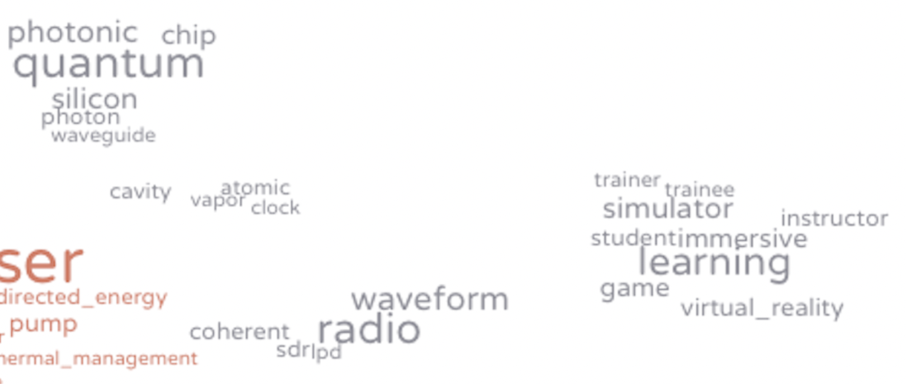
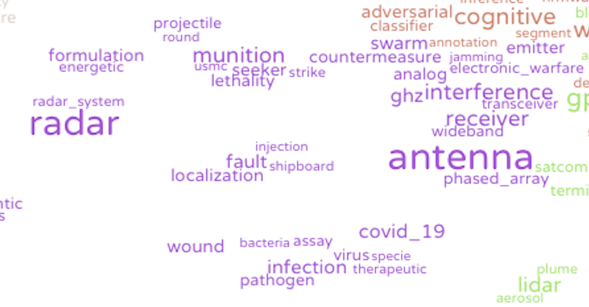

```{r}
library(dplyr)
library(ggplot2)
library(tidyverse)
library(knitr)
library(plotly)
```

```{r}
load("~/ShinyApps/defense2022/SBIR_Project/SBIR_Project_data.rdata")
```
<h1>SBIR/STTR</h1>
<h5>資料年份包含2020-2021</h5>
<h5>資料總共有7196筆，分成15個部門</h5>
<h5>文字分析包含"key words"和"Abstract"兩個欄位</h5>
<br>
<br>
<h2>各部門的資料筆數</h2>
<h5>1.資料總共有7196筆，分成15個部門</h5>
<h5>2.Air Force、Army、Navy最多</h5>
<h5>3.Space Development Agency在2020年沒有資料</h5>
```{r}
branch <-  group_by(SBIR_STTR, Branch, `Award Year`) %>% 
  summarise(total=sum(`Award Amount`),C = length(Branch),avg = total/C) %>% 
  mutate(year = as.character(`Award Year`)) 
  
ggplotly (ggplot( data = branch,
        aes( x = reorder(Branch,-C),
             y = C,fill=year)) +
   geom_bar( stat = 'identity') +
  labs(title = '各部門補助案數量',
           x = '部門',
           y = '數量') +
    theme(axis.text.x = element_text(angle = 45, hjust = 1, vjust = 1)) )


```
<h3>各部門的總補助金額</h3>
<p>因為Air Force、Army、Navy最多，總補助金額也最高</p>

```{r}

ggplotly(branch%>% 
  ggplot(aes(x = reorder(Branch,-total), y=total/10000, fill=year)) + 
  geom_col() +
  labs(title = '各部門總補助金額',
           x = '部門',
           y = '總補助金額(萬美金)')+theme(axis.text.x = element_text(angle = 45, hjust = 1, vjust = 1)))
```
<h3>各部門平均每筆的補助金額</h3>
<p>因為各個部門的data筆數差蠻多的，所以看平均一個補助案的補助金額。</p>
<p>2020和2021加總：平均補助金額變成 Defense threat reduction 最高</p>
<p>2020年：平均補助金額是Strategic Capabilities Office最高</p>
```{r}
ggplotly(branch %>% 
  ggplot(aes(x = reorder(Branch,-total/C), y=total/10000/C, fill=year)) + 
  geom_col() +
  labs(title = '各部門平均補助金額',
           x = '部門',
           y = '平均補助金額(萬美金)')+theme(axis.text.x = element_text(angle = 45, hjust = 1, vjust = 1)) )
```

<h2>補助案標籤</h2>
<h3>Reserch Keywords欄位的標籤出現頻率</h3>
<p>- 總共有23153個不同的標籤</p>
```{r}

df1$kw = str_replace_all(
      df1$kw,"AI","artificial intelligence")
df1$kw = str_replace_all(
      df1$kw,"Artificial Intelligence(AI)", "artificial intelligence")
df1$kw = str_replace_all(
      df1$kw,"Artificial Intelligence(artificial intelligence)","artificial intelligence")
df1$kw = str_replace_all(df1$kw,"Autonomy","Automation")
df1$kw = str_replace_all(
      df1$kw,"AUTONOMOUS","Automation")
df1$kw <- gsub(" ", "_", df1$kw) #關鍵字用底線代替空格
df2 <- df1 %>% group_by(kw) %>% 
  summarise(count_kw = length(kw)) %>%arrange(desc(count_kw))
df2 <- na.omit(df2) %>%  head(20)

ggplotly(ggplot(df2,aes(x = reorder(kw,count_kw), y = count_kw))+
  geom_bar(stat = "identity")+
  labs(title = '關鍵字(標籤)出現頻率',
           x = NULL,
           y = '頻率')+
  coord_flip()+
  geom_text(mapping = aes(label = count_kw),
            size = 3, colour = 'black', vjust = 0.5))

```
<p>出現最多的是artificial intelligence、machine learning</p>
<p>- UAS : Unmanned Aircraft System 無人機系統<br>
- UAV : Unmanned Aerial Vehicle 無人機</p>

<h3>Key Words 關聯式文字雲</h3>


<h4>autonomy為中心</h4>


<p>- autonomy相關的關鍵字字有dual-use、Aircraft、commercial、	disruptive、charging、algorithms(演算法)，大多是敘述有關自駕車、無人機相關的補助案，相關技術有電力、電池相關、演算法。</p>

<br>
<h4>AR/VR為中心</h4>


<p>除了有AR、VR之外，相關的關鍵字還有mixed reality、training、simulation、modeling、cybersecurity、blockchain、IoT、devsecops(有關資訊安全的應用程式)、Kubernetes(用於自動部署、擴展和管理容器化應用程序的公開系統)，主要是和航空、訓練、成像、模擬相關，也有和軟體開發、資訊安全相關。</p>
<br>
<h4>infrared為中心</h4>

<p>和infrared(紅外線的)相關的關鍵字，包含remote sensing、optics(光學的)、
MWIR(Middle Wavelength Infrared)、LWIR(Long Wavelength Infrared)、Quantum cascade lasers(量子級聯雷射器)、PNT(Position Navigation and Timing)，主要是和光學、雷射所應用於無人機(可應用MWIR和LWIR)或導航相關。

<h4>machine learning和artificial intelligence為中心</h4>

<p>machine learning和artificial intelligence是資料中出現最多次的關鍵字，有一同出現的關鍵字範圍廣，因此也聚集在關聯式文字雲的中間。
而透過tsne的關聯式文字雲相關的關鍵字有neural networks(神經網絡)、additive manufacturing(積層製造)、algorithm(演算法)、natural language processing、Sensor fusion(傳感器融合)
。主要是和數據、無人機或自駕車、太空、衛星的應用相關。</p>
<br>
<br>
<h2>摘要</h2>
<h3>文字處理流程</h3>
<p>1.取得原始文集<br>
2.使用AutoPhrase產生初始斷詞字典<br>
3.使用Python，將文集利用斷詞字典把底線相連，利用spacy進行斷詞，最後整理斷詞後的資料匯出csv。<br>
4.使用R，利用udpipe提供的function，進行ngram計算與TF-IDF篩選，挑選一定詞頻的字詞，更新斷詞字典。<br>
5.重複3~4<br>
6.最後再根據TF-IDF等指標篩選出關鍵字字典。</p>
```{r}
#library(readr)
#dict3 <- read_csv("dict3.csv")
#SBIRtoken_des1 = read.csv('./des_token_r3.csv',stringsAsFactors = F)
#lemma_des <- read.csv('./lemma_des.csv',stringsAsFactors = F)
```
<h3>斷詞字典詞頻</h3>
```{r}
phrase_freq = lemma_des %>%
  filter((token%in%dict3$replacement)) %>% 
  group_by(token) %>% count() %>% 
  arrange(desc(n))

ggplotly(
  lemma_des %>%
  filter((token%in%dict3$replacement)) %>% 
  group_by(token) %>% count() %>% 
  arrange(desc(n)) %>% 
  head(15) %>% 
  ggplot(aes(x = reorder(token, n), y = n)) + 
  geom_bar(stat = "identity") +
  coord_flip()+
  geom_text(mapping = aes(label = n),
            size = 3, colour = 'black', vjust = 0.5)+
    labs(x = NULL, y = '頻率', title = '斷詞字典詞頻') 
  )
```
<p>出現最多的是air force，應該是跟屬於空軍的補助案資料數量有關係</p>
<br>
<br>
<h3>TF-IDF</h3>
<p>TF：Term Frequency <br>
IDF：Inverse Document Frequency <br>
計算出誰是相對比較重要的字詞 <br>
→字詞的重要性隨著在文本出現的頻率越高則越高；在不同文本檔案間出現的次數越高則反而降低。</p>

```{r}
#去除無效的摘要token
lemma_des$token = str_replace_all(
 lemma_des$token,"xxxxx"," ")
lemma_des$token = str_replace_all(
  lemma_des$token,"qqq"," ")
lemma_des$token = str_replace_all(
  lemma_des$token,"xxx"," ")
lemma_des$token = str_replace_all(
  lemma_des$token,"XX"," ")
lemma_des$token = str_replace_all(
  lemma_des$token,"BLANK"," ")
lemma_des$token = str_replace_all(
  lemma_des$token,"redact"," ")
```

```{r}
library(udpipe,lattice)
Abstract_tf_idf1 <- document_term_frequencies(lemma_des[, c("doc_id", "token")])
Abstract_tf_idf1 <- document_term_frequencies_statistics(Abstract_tf_idf1)

stopwords <- stopwords::stopwords("en", source = "smart")
Abstract_tf_idf1 <- Abstract_tf_idf1 %>%
  filter(nchar(term) >1) %>% 
  filter(!(tolower(term) %in% stopwords))

# 每個字平均tf-idf
word_tfidf <-Abstract_tf_idf1%>% 
  group_by(term) %>% 
  summarise(tf_idf = mean(tf_idf),freq = sum(freq))


```

```{r}
ggplotly(
  word_tfidf %>% 
  arrange(desc(tf_idf)) %>% 
  head(10) %>%
  ggplot(aes(freq,reorder(term,freq))) +
  geom_bar(stat = "identity") +
  geom_text(mapping = aes(label = freq),
            size = 3, colour = 'black', vjust = 0.5)+
  labs(x = "頻率", y = NULL, title = 'SBIR/STTR高TF-IDF字的詞頻')
)
```
<p>- EFP: explosively formed penetrator爆炸成形穿甲彈<br>
- neck-in內縮量</p>
```{r}
# 篩選詞頻大於1
word_tfidf1 <-Abstract_tf_idf1%>% 
  group_by(term) %>% 
  summarise(tf_idf = mean(tf_idf), freq = mean(freq)) %>% filter(freq >1)
ggplotly(
  word_tfidf1 %>% 
  arrange(desc(tf_idf)) %>% 
  head(10) %>%
  ggplot(aes(freq,reorder(term,freq))) +
  geom_bar(stat = "identity") +
  geom_text(mapping = aes(label = freq),
            size = 3, colour = 'black', vjust = 0.5)+
  labs(x = "頻率", y = NULL, title = 'SBIR/STTR高TF-IDF字的詞頻（篩選詞頻大於1)')
)
```
<p>SWBLI : separation length of shock wave/boundary layer interaction 衝擊波邊界層相互作用的長度</p>

<h3>Abstract 關聯式文字雲</h3>



<h4>battery為中心</h4>


<p>在摘要中和battery相關的字有li ion(鋰離子)、energy storage、electrode(電極)，補助案有和能源儲存、太空、飛機相關。

<h4>satellie為中心</h4>


<p>在摘要中和satellie相關的字有GEO(geosynchronous equatorial orbit地球同步轉移軌道)、LEO(low-Earth orbit低地球軌道)、orbit(軌道)、spacecraft、cislunar(月軌道)。<br>
摘要字詞同一個分群內也有composite(複合材料)、3D列印、積層製造、CMC(陶瓷基複合材料)、combustion(燃燒)、propellant(推進器)相關。
-CMC(Ceramic matrix composite):材料有在高溫下的耐腐蝕和耐磨性，因此適合太空相關的應用</p>

<h4>radio為中心</h4>


<p>在摘要中和radio相關的字有waveform、SDR(Software Defined Radio)、LPD(low probability of detection)、coherent。<br>
同一個分群內也有Virtual reality、learning、immersive(沈浸式)、simulator。<br>
另一邊同一個分群內也有quantum、photonic(光子)、silicon(矽)、chip。</p>
<h4>antenna為中心</h4>

<p>在摘要中和antenna(天線)相關的字有phased array(相位陣列:由一群天線組成的陣列)、GHz、reciver、analog(模擬)、interference。<br>
同一個分群內也有radar、munition(軍備品)、lethality(致命性)、projectile(彈藥)、wound(傷口)、infection。</p>

<h1>📕中心關心的關鍵字</h1>
<h5>- 光電倍增管 (光放管) （Photomultiplier，簡稱PMT，或者night vision goggle）：10筆<br>
- AR/VR ：106筆<br>
- 靶機 (target drone) ：1筆<br>
- 陀螺儀(gyroscope) ：24筆</h5>
<p>補助案資料 https://docs.google.com/spreadsheets/d/1i42hjeFSPnyWylIzEfCCwRFh_Xf-3BF9/edit?usp=sharing&ouid=114055699503210022790&rtpof=true&sd=true </p>
<br>
<h4>篩選"key words"和"Abstract"兩個欄位有出現中心在意的關鍵字</h4>
<br>
<h2>一、有提到光放管的補助案</h2>
<h5>只有10筆</h5>
```{r}
A <- SBIR_STTR
A$id = 1:nrow(A)
d3 <- A %>% filter(grepl(".*Photomultiplier|.*PMT|.*night vision goggle",`Research Keywords`)) %>% 
  full_join( A %>% filter(grepl(".*Photomultiplier|.*PMT|.*night vision goggle", Abstract)))
d3 <- d3 %>% filter(id!=1292 &id!=3782 &id!=1974 &id!=2198& id!=2205& id!= 4292)
d3_PMT <- d3 %>% summarise(id = 1:nrow(d3), kw = `Research Keywords`,Abstract)
```
<h3>提到光放管補助案所屬的部門</h3>
```{r}
d3_b <- d3 %>% group_by(Branch) %>% summarise(c = length(Branch)) %>% na.omit() #有一筆部門是na
ggplotly(
  ggplot(d3_b)+
  geom_col(aes(x = reorder(Branch,c), y = c ))+
  geom_text(aes(x = Branch, y = c ,label = c),size = 3, colour = 'black', vjust = 0.5)+
  labs(x = "補助案所屬部門", y = "資料筆數")+
  coord_flip() )
```
<h3>提到光放管補助案所屬的前20大標籤</h3>
```{r}
d3_PMT$kw <- str_split(d3_PMT$kw,",") 
l3<- unnest(d3_PMT, kw) 
l3.table <- table(l3$kw) %>% as.data.frame() %>% arrange(desc(Freq))
#59個關鍵字
l3.table20 <- l3.table %>% head(20) 
#畫前20大相關連的kw
ggplotly(
  ggplot(l3.table20)+
  geom_col(aes(x = reorder(Var1,Freq), y = Freq ))+
  geom_text(aes(x = Var1, y = Freq ,label = Freq),size = 3, colour = 'black', vjust = 0.5)+
  labs(x = "相關的標籤", y = "出現次數")+
  coord_flip() )
```

<p>相關的標籤有augmented reality(AR),head mounted display(HMD,頭戴式裝置),Night vision,Light Security,ambient filter(環境過濾器)<br>
→都是和夜視鏡比較有關 <br>
- CLYC ：Cs2LiYCl6:Ce 新型伽馬中子復合閃爍晶體<br>
- CLLBC：Cesium Lanthanum Lithium BromoChloride <br>
- CASEVAC(Casualty evacuation)<br>
- Light Secure Special Warfare Display(LSSWD) </p>
<br>
<h3>提到光放管補助案的摘要</h3>
<p>補提到光放管的補助案只有兩筆：<br>
1.用矽為基礎的光電倍增管芯片，改善矽光電倍增管silicon photomultipliers (SiPMs)，以實現大面積光電倍增器芯片，並使它有輻射耐受性。<br>
2.開發混合鈣鈦礦閃爍體(mixed elpasolite scintillators)，結合SiPM （矽光電倍增管）和 PMT提高能量分辨率<br>
其他補助案內容大多都不是以光放管為主：<br>
有兩則提到用主題為AR相關(只是敘述提到夜視鏡而已)、兩則提到其攜帶式電源可供應各種設備(如夜視鏡)、或是新型材料改善傳統的紅外光學器件體積龐大</p>
<br>
<h2>二、有提到AR/VR的補助案</h2>
<h5>有106筆</h5>
```{r}
#AR/VR  #有106筆
d4 <- A %>% filter(grepl(".*augmented reality|.*virtual reality", `Research Keywords`))%>% 
  full_join( A %>% filter(grepl(".*augmented reality|.*virtual reality", Abstract)))
d4_ARVR <- d4 %>% summarise(id = 1:nrow(d4), kw = `Research Keywords`,Abstract)
```
<h3>提到AR/VR補助案所屬的部門</h3>
```{r}
d4_b <- d4 %>% group_by(Branch) %>% summarise(c = length(Branch))
ggplotly(
  ggplot(d4_b)+
  geom_col(aes(x = reorder(Branch,c), y = c ))+
  geom_text(aes(x = Branch, y = c ,label = c),size = 3, colour = 'black', vjust = 0.5)+
    labs(x = "補助案所屬部門", y = "資料筆數")+
  coord_flip() )
```

<h3>提到AR/VR補助案所屬的前30大標籤</h3>
```{r}

d4_ARVR$kw <- str_split(d4_ARVR$kw,",") 
l4<- unnest(d4_ARVR, kw) 
l4.table <- table(l4$kw) %>% as.data.frame() %>% arrange(desc(Freq))
#470個關鍵字
l4.table30 <- l4.table %>% head(30)
#畫前30大相關連的kw
ggplotly(
  ggplot(l4.table30)+
  geom_col(aes(x = reorder(Var1,Freq), y = Freq ))+
  geom_text(aes(x = Var1, y = Freq ,label = Freq),size = 3, colour = 'black', vjust = 0.5)+
    labs(x = "相關的標籤", y = "出現次數")+
  coord_flip() )
```

<p>相關的標籤有machine learning,artificial intelligence, SAR(Source Approval Request),lidar(光學雷達),Radar <br>
- UAS(Unmanned Aircraft System 無人機系統)<br>
- ISR(Intelligence, Surveillance, and Reconnaissance)：是一種綜合情報和作戰職能，可以定義為協調獲取、處理和提供準確、相關、及時的信息和情報，以支持指揮官的決策過程。<br>
- DLA（Defense Logistics Agency國防後勤局) </p>
<br>
<h3>提到AR/VR補助案的摘要</h3>
<p>補助案大多是和空軍的飛行訓練有關，或是飛行相關應用的延伸（如加強導彈防禦任務、衛星協作工具SCTK），也有部分是醫療模擬培訓系統、機器人（結合AI或3D模型）相關主題，少部分有提到用於海軍提升海軍系統的水下環境感知、或是以頭戴式裝置改善暈眩或是PTSD。</p>
<br>
<h2>三、有提到target drone的補助案</h2>
<h5>只有一筆</h5>
<h5>包含drone的有228筆</h5>
```{r}
#target drone #只有一筆
d5 <- A %>% filter(grepl(".*target drone", `Research Keywords`))%>% 
  full_join( A %>% filter(grepl(".*target drone", Abstract)))
#包含drone #228筆
d5_1 <- A %>% filter(grepl(".*target drone|.*drone", `Research Keywords`))%>% 
  full_join( A %>% filter(grepl(".*target drone|.*dron", Abstract)))
```
<p>補助案的內容是ASC利用<strong>LiDAR(global shutter 3D flash LiDAR)為傳感器</strong>，用於測量距離、變化、方位等，並輸出3D點雲。再利用非光束轉向(non-mechanical beam steering)、帶有3D點雲的2D高分辨率影像以生成高分辨率(2D high resolution video with the 3D point cloud )的3D影像來幫助評估導彈。<br>
ASC是Continental Motors軍用LiDAR產品的獨家授權經銷商，希望夠過此方法降低成本將其技術安裝在靶機上。</p>
<br>
<h3>上述target drone補助案的標籤</h3>
<p>Global Shutter 3D Flash LiDAR,3D Point Cloud,real time 3D video,high resolution 3D video,Dynamic Range,Field of view,Laser,Focal plane array</p>
<br>
<h5>包含drone的補助案</h5>
<p>提到drone的補助案內容，皆和靶機沒有關係，提到的內容都是其他無人機運用（如：運送、監控、蒐集不同場域的資料）；或是無人機系統或技術上的改善。</p>

<h2>四、有提到gyroscop的補助案</h2>
<h5>只有24筆</h5>
```{r}
#gyroscop #只有24筆
d6 <- A %>% filter(grepl(".*gyroscope|.*Gyroscope", Abstract, ))%>% 
  full_join( A %>% filter(grepl(".*gyroscope|.*Gyroscope",`Research Keywords`)))
d6_gyroscop <- d6 %>% summarise(id = 1:nrow(d6), kw = `Research Keywords`,Abstract)

```
<h3>提到gyroscop補助案所屬的部門</h3>
```{r}
d6_b <- d6 %>% group_by(Branch) %>% summarise(c = length(Branch))
ggplotly(
  ggplot(d6_b)+
  geom_col(aes(x = reorder(Branch,c), y = c ))+
  geom_text(aes(x = Branch, y = c ,label = c),size = 3, colour = 'black', vjust = 0.5)+
    labs(x = "補助案所屬部門", y = "資料筆數")+
  coord_flip() )
```

<h3>提到gyroscop補助案所屬的前20大標籤</h3>
```{r}

d6_gyroscop$kw <- str_split(d6_gyroscop$kw,",") 
l6<- unnest(d6_gyroscop, kw) 
l6.table <- table(l6$kw) %>% as.data.frame() %>% arrange(desc(Freq))
#107個關鍵字
l6.table20 <- l6.table %>% head(20)
#畫前50大相關連的kw
ggplotly(
  ggplot(l6.table20)+
  geom_col(aes(x = reorder(Var1,Freq), y = Freq ))+
  geom_text(aes(x = Var1, y = Freq ,label = Freq),size = 3, colour = 'black', vjust = 0.5)+
    labs(x = "相關的標籤", y = "出現次數")+
  coord_flip() )
```
<p>相關的標籤有Accelerometer/Accelerometry(加速儀/加速器),Navigation,Anomalous Dispersion(色散異常),Inertial measurement unit(IMU,慣性測量單位),Superluminal Laser(超光速雷射),Rubidium Atoms(銣)<br>
- IMU 慣性測量單位（Inertial measurement unit，簡稱IMU）:是測量物體三軸姿態角(或角速率)以及加速度的裝置。<br>
- MEMS 微機電系統(Microelectromechanical Systems) <br>
- GNC (Guidance,Navigation& Control) <br>
- AFSOC(Air Force Special Operations Command )</p>
<h3>提到gyroscop補助案的摘要</h3>
<p>補助案大多是和導航有關，像是在特殊環境、太空上、海下的導航；其他也有提到相關的陀螺儀技術（如：熔融石英水盆諧振器陀螺儀 BRG、MEMS 陀螺儀）</p>